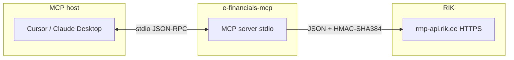

# e-financials-mcp

Open-source MCP server for the [Estonian RIK e-Financials](https://abiinfo.rik.ee/en/e-financials/e-financials-api/technical-documentation-developers) REST API. It exposes accounting operations (bank transactions, clients, invoices, chart of accounts, journals, products, reports) as **Model Context Protocol** tools so AI assistants (Cursor, Claude Desktop, etc.) can work with your company's e-Financials data over **stdio**.

## Quick start

```bash
git clone https://github.com/werkstatt/e-financials-mcp.git
cd e-financials-mcp
cp .env.example .env
# Fill in your RIK API credentials in .env
npm install
npm run build
npm start
```

## Prerequisites

- **Node.js 18+** (for native `fetch`).
- An **e-Financials API key** for your company.

### API keys

A board member (or authorized user) can create keys in e-Financials:

**Settings > General settings > e-Financials API access permits**

Each key requires a name, allowed IP addresses, and at least one permitted function.

## Environment variables

Copy `.env.example` to `.env` and fill in your credentials. The server loads `.env` automatically via `dotenv/config` at startup. **Never commit `.env`** (it is gitignored).

| Variable | Required | Description |
|----------|----------|-------------|
| `RIK_API_KEY_ID` | Yes | API key identifier (used in the HMAC signing string). |
| `RIK_API_KEY_PASSWORD` | Yes | Secret used as the HMAC key. |
| `RIK_API_KEY_PUBLIC` | Yes | Public part of `X-AUTH-KEY` (from e-Financials). |
| `RIK_API_BASE_URL` | No | Base URL without trailing slash. Default: `https://rmp-api.rik.ee`. Set to `https://demo-rmp-api.rik.ee` for the demo environment. |
| `RIK_HTTP_MAX_RETRIES` | No | Extra HTTP attempts for transient failures (network errors, 408, 429, 5xx). Default: `0`. |
| `RIK_HTTP_RETRY_BASE_MS` | No | Base delay in ms for exponential backoff. Default: `500`. |
| `RIK_REQUEST_TIMEOUT_MS` | No | Maximum time in ms per outbound request. Default: `30000`. |
| `LOG_LEVEL` | No | Pino log level on **stderr**: `fatal`, `error`, `warn`, `info`, `debug`, `trace`, `silent`. Default: `info`. |

## MCP host configuration

Point your MCP client at the built server.

**Cursor** (`~/.cursor/mcp.json` or project `.cursor/mcp.json`):

```json
{
  "mcpServers": {
    "e-financials": {
      "command": "node",
      "args": ["/absolute/path/to/e-financials-mcp/dist/index.js"],
      "env": {
        "RIK_API_KEY_ID": "your_api_key_id",
        "RIK_API_KEY_PASSWORD": "your_api_key_password",
        "RIK_API_KEY_PUBLIC": "your_base64_public_key"
      }
    }
  }
}
```

**Claude Desktop** — same pattern under `mcpServers` in the app's config file, adjusting paths for your OS.

Alternatively, if your `.env` file is populated and the working directory is the project root, `npm start` picks up credentials automatically.

## Architecture



## Authentication (how requests are signed)

1. **`X-AUTH-QUERYTIME`** — UTC timestamp, one-second precision, no milliseconds.
2. **`X-AUTH-KEY`** — `{RIK_API_KEY_PUBLIC}:{signature}` where `signature` is **Base64(HMAC-SHA-384)** over `{RIK_API_KEY_ID}:{X-AUTH-QUERYTIME}:{urlPath}`.
3. `urlPath` is the **path only** (e.g. `/v1/transactions`), no query string.

## MCP tools reference

The server advertises **82 tools** across transactions, clients, invoices, invoice settings, products, journals, accounts, reference data, and reports. All tool results are JSON in text content blocks.

### Transactions

| Tool | Description |
|------|-------------|
| `list_transactions` | List bank transactions with filters (status, dates, type, client, page). |
| `get_transaction` | Single transaction by ID. |
| `get_unprocessed_transactions` | `PROJECT` transactions with no client. |
| `update_transaction` | PATCH draft transaction. |
| `create_transaction` | POST new draft (`PROJECT`). |
| `delete_transaction` | DELETE transaction. |
| `register_transaction` | Register with distributions array. |
| `invalidate_transaction` | Reverse registration. |
| `get_transaction_file` | GET attached file. |
| `upload_transaction_file` | Upload file from local path. |
| `delete_transaction_file` | DELETE attached file. |

### Clients

| Tool | Description |
|------|-------------|
| `list_clients` | Paginated client list. |
| `list_suppliers` | Clients with `is_supplier: true`. |
| `get_client` | One client by ID. |
| `search_clients` | Search over all pages (name, reg code, email). |
| `create_client` | Create a new client. |
| `update_client` | Partial update. |
| `delete_client` | Permanent removal. |
| `deactivate_client` | Soft-disable. |
| `reactivate_client` | Re-enable. |

### Invoices

| Tool | Description |
|------|-------------|
| `list_sales_invoices` | Sales invoices with filters. |
| `list_purchase_invoices` | Purchase invoices with filters. |
| `list_unpaid_invoices` | Unpaid sales/purchase invoices. |
| `get_sales_invoice` | One sales invoice. |
| `get_purchase_invoice` | One purchase invoice. |
| `create_sales_invoice` | Draft sales invoice. |
| `create_purchase_invoice` | Draft purchase invoice. |
| `update_sales_invoice` | PATCH sales draft. |
| `delete_sales_invoice` | DELETE sales invoice. |
| `register_sales_invoice` | Confirm sales invoice. |
| `invalidate_sales_invoice` | Reverse sales confirmation. |
| `get_sales_invoice_xml` | System e-invoice XML. |
| `get_sales_invoice_pdf_system` | System PDF. |
| `get_sales_invoice_user_file` | User-uploaded file. |
| `upload_sales_invoice_user_file` | Upload file. |
| `delete_sales_invoice_user_file` | Delete user file. |
| `get_sales_invoice_delivery_options` | Delivery options (e-invoice/email). |
| `deliver_sales_invoice` | Send e-invoice/email. |
| `update_purchase_invoice` | PATCH purchase draft. |
| `delete_purchase_invoice` | DELETE purchase invoice. |
| `register_purchase_invoice` | Confirm purchase invoice. |
| `invalidate_purchase_invoice` | Reverse purchase confirmation. |
| `get_purchase_invoice_user_file` | User-uploaded file. |
| `upload_purchase_invoice_file` | Upload file. |
| `delete_purchase_invoice_user_file` | Delete user file. |

### Invoice settings

| Tool | Description |
|------|-------------|
| `get_invoice_info` | Company invoice settings. |
| `update_invoice_info` | Update invoice settings. |
| `list_invoice_series` | All invoice series. |
| `get_invoice_series` | One series by ID. |
| `create_invoice_series` | Create new series. |
| `update_invoice_series` | Update series. |
| `delete_invoice_series` | Delete series. |

### Products

| Tool | Description |
|------|-------------|
| `list_products` | Paginated product/service list. |
| `get_product` | One product by ID. |
| `create_product` | Create product. |
| `update_product` | Update product. |
| `delete_product` | Delete product. |
| `deactivate_product` | Soft-disable. |
| `reactivate_product` | Re-enable. |

### Journals

| Tool | Description |
|------|-------------|
| `list_journals` | Paginated journal list. |
| `get_journal` | One journal entry with postings. |
| `create_journal` | Create journal with postings. |
| `update_journal` | Update journal. |
| `delete_journal` | Delete journal. |
| `register_journal` | Register journal. |
| `invalidate_journal` | Reverse registration. |
| `get_journal_file` | GET attached file. |
| `upload_journal_file` | Upload file. |
| `delete_journal_file` | Delete file. |

### Accounts

| Tool | Description |
|------|-------------|
| `list_accounts` | Chart of accounts. |
| `search_accounts` | Search accounts by name or ID. |
| `list_account_dimensions` | Sub-accounts / dimensions. |
| `get_bank_accounts` | List bank accounts. |
| `create_bank_account` | Create bank account. |
| `get_bank_account` | One bank account. |
| `update_bank_account` | Update bank account. |
| `delete_bank_account` | Delete bank account. |
| `get_vat_info` | Company VAT / tax reference. |
| `list_projects` | Cost/profit centres. |
| `list_purchase_articles` | Purchase expense categories. |

### Reference data

| Tool | Description |
|------|-------------|
| `list_currencies` | Active company currencies. |
| `list_sale_articles` | Sale articles linked to accounts and VAT. |
| `list_templates` | Sale invoice templates. |

### Reports

| Tool | Description |
|------|-------------|
| `reconciliation_report` | Aggregates transactions + invoices for a period. |
| `match_transaction_to_supplier` | Word overlap scoring vs suppliers. |
| `financial_summary` | Month rollup (default: current month). |

## Upstream API documentation

| Resource | URL |
|----------|-----|
| Developer overview | https://abiinfo.rik.ee/en/e-financials/e-financials-api/technical-documentation-developers |
| API key generation | https://abiinfo.rik.ee/en/e-financials/e-financials-api/e-financials-api-key-generation |
| OpenAPI 3.1 spec | https://rmp-api.rik.ee/openapi.yaml |
| HTML API reference | https://rmp-api.rik.ee/api.html |

**Environments:** Live `https://rmp-api.rik.ee` (default) | Demo `https://demo-rmp-api.rik.ee`

## Development

```bash
npm run dev          # TypeScript watch mode
npm test             # unit tests (Vitest)
npm run test:coverage # with coverage report
npm run lint         # Biome check
npm run lint:fix     # auto-fix
```

## Testing

Unit tests mock `EFinancialsClient` and never hit the real API. Shared response fixtures live in `src/__fixtures__/`. Integration tests in `src/integration/` run against the demo API (requires `RIK_API_*` env vars).

```bash
npm test                # unit tests only
npm run test:integration # live integration tests
```

## Contributing

1. Fork the repository
2. Create a feature branch (`git checkout -b feature/my-change`)
3. Run `npm run lint:fix && npm run test:coverage` before committing
4. Open a pull request

## License

[MIT](LICENSE)

Support for the official API: **earveldaja.api@rik.ee** (per OpenAPI `info.contact`).
